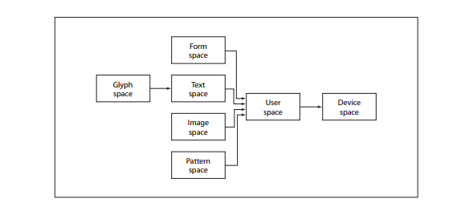

# Week 2: Literature & PDF research, and Woo

## Tasks

1. Reformulate research question (incorporate feedback Maarten)
2. Work out concept **_introduction_ and _related work_** for Thesis
3. Play around with PDF manipulation
4. Search for more literature. Explore!

   - Problem: more on OCR and scanning for better description of contextual problem
   - Context: concrete examples related to Woo?; images.
   - Solution: anything really
   - ~~PDF: anything about how PDF's work and how we can manipulate them.~~ => 1.7 specifications

5. ~~Incorporate peer-review feedback~~
6. ~~Agenda for Friday 10 Nov~~

## Findings

#### Woensdag 8-11

User space -> device space : current transformation matrix

Length of a unit along both the x and y axes are set by the **userunit** entry in the page dictionary. If not present or supported, the default value of 1/72 inch is used (**default user space**). A point.

Text space => text space -> user spae : text matrix
Character glpyhs in a font => glyph space -> text space : font matrix (for most type of fonts, this matrix shall be predefind to map 1000 units of glyph space to 1 unit of text space; for type 3 fonts, the font matrix shall be given in the font dictionary).

Images => image space -> user space : predefined and cannot change.

Transformation matrix has six number [a, b, c, d, e, f]
(p. 118) has some standard matrices.

Nog veel meer over PDF specification gerelateerd aan de verschillende operators die je kan tegenkomen. Meeste staat in mijn **main.py** notebook.

#### Dinsdag 7-11

I need to write a PDF stream command interpreter to display the PDF visually in a, for example, html/css format.

Text can be interpreted using the font cmap.

I need to check different values for a inserted pdf:

1.  what kind of pdf version
2.  what kind of encoding for the font/type of font
3.  Encrypted pdf?
4.  Does it contain javascript?

##### PDF graphics

- Graphic state operators manipulate the data structure called the **graphics state**, the global framework within which the other graphics operators execute. Includes the **current transformation matrix (ctm)**, which maps user space coordinated used within a pdf content stream into output device coordinated. It also includes **current colour,clipping path**, and other parameters that are implicit operands of the painting operators.

- **Path construction operators** specify **paths**, which define shapes, line trajectories, and regions of various sorts.Operators for beginning an new path, adding line segments and curves to it, and closing it.

- **Path painting operators** fill a path with a colour, paint a stroke along it, or use it as a clipping boundary.

- **Other painting operators**

- **Text operators** select and show character glyphs from fonts (descriptions of typefaces for representing text characters). Because PDF treats glpyhs as general graphical shapes, many of the text operators could be grouped with the graphics state or painting operators.

- **Marked-content operators** associate higher-level logical information with objects in the content stream.

Data in a content stream shall be interpreted as **a sequence of operators and their operands, expressed as basic data objects according to standard PDF syntax. A content stream can describe the appearance of a page, or it can be treated as a graphical element in certain other context.**

Operands and operators shall be written sequentially using **postfix** notation.

PAGE 113:

1. Page description level
2. Path object
3. Based on type of object/page: a object i.e. text object with BT ET.

> MAYBE MAKE A STATE MACHINE FOR OPERATOR HANDELING?

#### Maandag 6-11

PDF specifications 9.5 & 9.6; simple fonts. (p.253)
Font types: distinguished by the **SubType** entry in the font dictonary.

Type 0, Type 1 (Type1 and MMType1), Type3, TrueType, CIDFon(CIDFontType0, CIDFontType2)

Different fonts, different internals.

page 111, 8 graphics

## Literature

## Possible solutions
